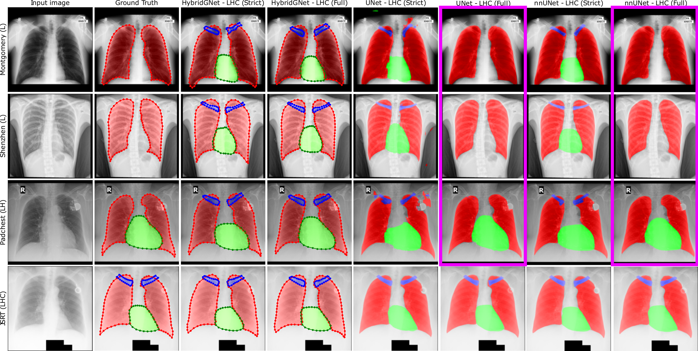

# Multi-center anatomical segmentation with heterogeneous labels via landmark-based models.

This git repo contains the source code for the "Multi-center anatomical segmentation with heterogeneous labels via landmark-based models" paper.

Arxiv link:

## Dataset:

For more information on the database please check the [Chest-xray-landmark-dataset](https://github.com/ngaggion/Chest-xray-landmark-dataset) repository.

## Paper reproducibility:

Link to download the weights of the trained models: [drive](https://drive.google.com/file/d/1yjXB0VgPY2mdz6TVpI-wtFJVUVv2GLj3)

Link to download the latents for UMAP dimensionality reduction script: [drive](https://drive.google.com/file/d/13EKbgSNZ9pON_vuVHT99BVqSnlwj8Pae)

For more information about the HybridGNet model please check the [HybridGNet](https://github.com/ngaggion/HybridGNet) repository.